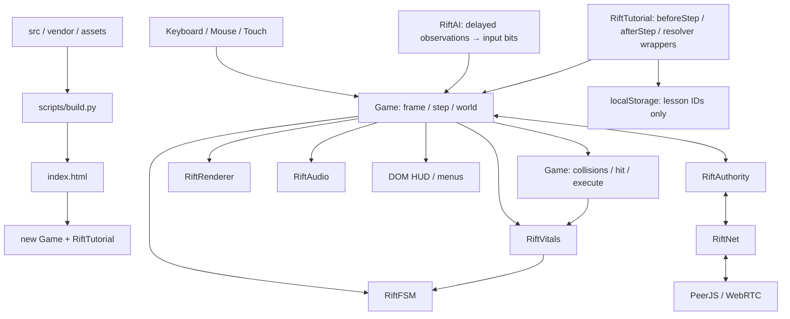
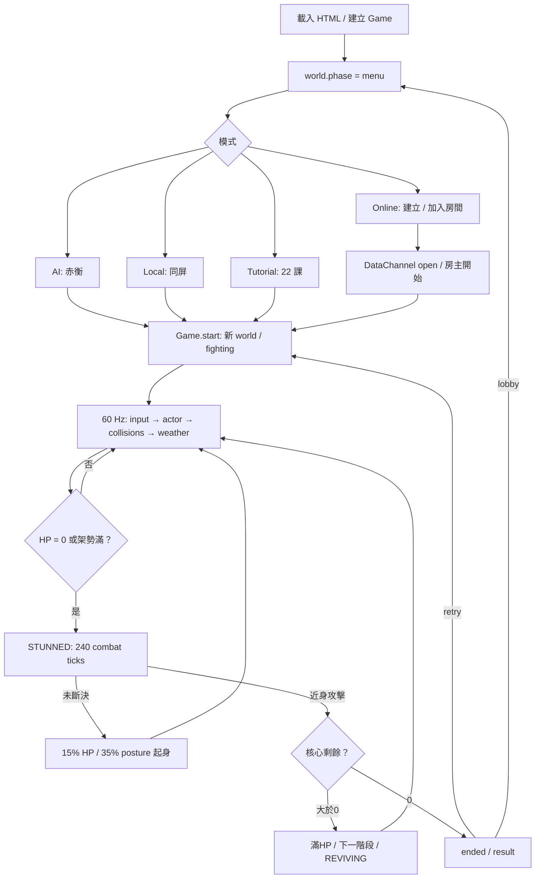
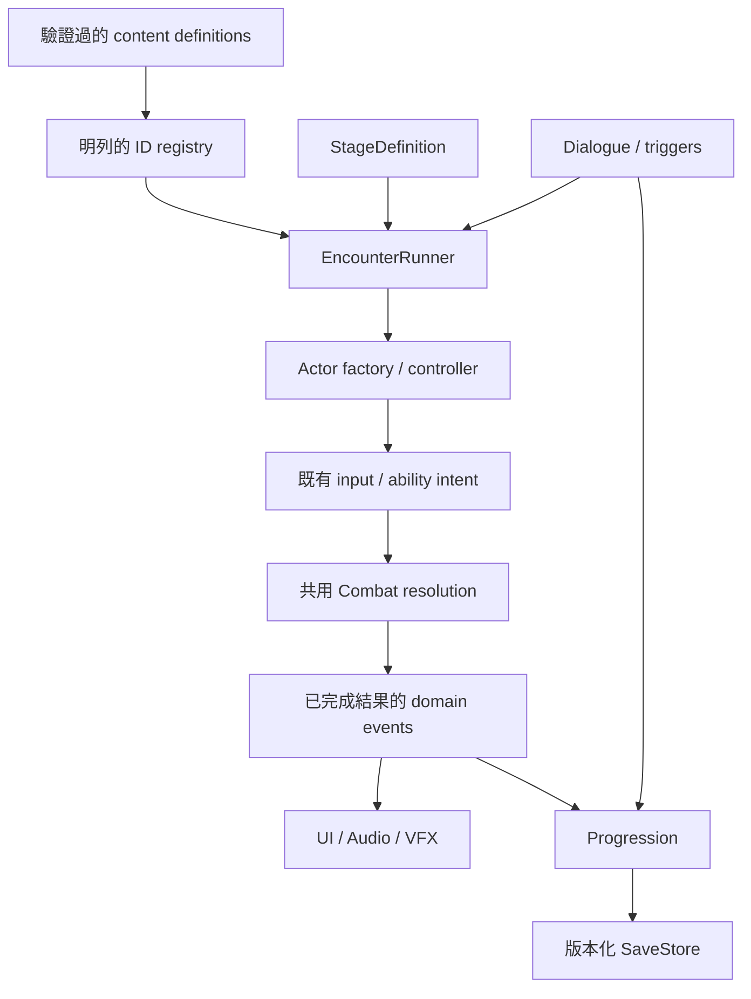
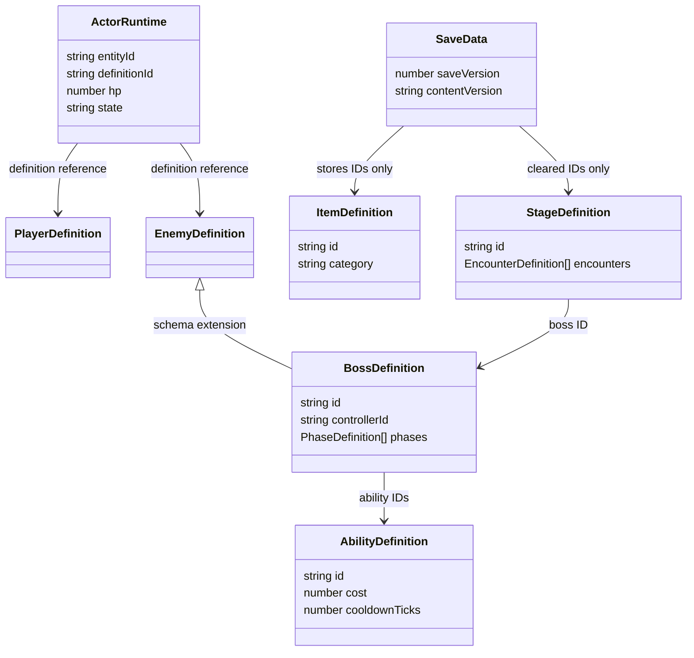

# 架構：可重建的單檔遊戲

## IMPLEMENTED：目前的邊界

這是自製 Canvas 遊戲，不是 Phaser、React 或 ECS。九個原生 JS 模組透過全域 `Rift*` 物件與 IIFE 解耦，`Game` 仍負責大量協調工作。build 將這些模組、PeerJS、DOM/CSS 和兩段 MP3 內嵌到單一 HTML。具體入口見 [PROJECT_MAP](PROJECT_MAP.md)。

箭頭代表呼叫／資料使用，不代表已有通用 EventBus。`RiftRenderer` 讀取 actor state 繪製，也會寫入 `world.camera`；它不是完全無副作用的純函式。`RiftTutorial` 包裝 `hit/counter/execute` 觀察真實結果；不得誤寫成事件訂閱架構。

### 載入與建置

固定順序：`peerjs → net → fsm → vitals → authority → audio → ai → render → tutorial → core`。最後 `core` 建立實例，`tutorial` 類別因此必須先載入。新增模組需明列於 build，不做自動遞迴掃描或 runtime `fetch`。理由見 [ADR-001](adr/001-source-and-single-file.md)。

### 運作流程

角色容量已由 `maxHp / maxPosture / maxNodes` 表示：玩家、PvP與教學100／100／2；AI模式的赤衡240／220／3。`BOSS_PROFILE` 在core中明確套用，`attackDefinition()` 統一建立Boss起手／波次覆寫的攻擊複本，Vitals以容量／比例處理恢復、崩解與復燃，HUD按比例與核心數顯示。它是已使用的小接點，尚非Boss registry或通用Stats引擎。詳 [ADR-004](adr/004-readable-rhythm-and-boss-capacity.md)。

教學有保護：課程可重置／補充資源，結業只驗證第一核心，不允許正常完成課程後第二次斷決結束訓練。線上回合還需防守方確認斷決；示意流程沒有省略這個權限要求。

### 三種不同的時間

| 時間 | 所在 | 用途 |
| --- | --- | --- |
| fixed tick | `Game.frame/step` | 60 Hz、最多補 6 步；hitstop期間不增加combat tick、凍結AI觀察／排程，仍緩衝輸入、更新部分特效 |
| render time | `RiftRenderer.render` 的 `performance.now()` | 相機與視覺動畫，不應新增傷害或決定攻擊結束 |
| network wall time | `Date.now()` + clock offset | 意圖時間補償／RTT；不是另一份 authoritative gameplay clock |

戰鬥在共用 `MOVES`／FSM上加入16→12 tick招架窗口、8 tick防禦緩衝、指定輕招6 tick收招取消、6 tick多波接觸窗及Boss非末波招架保留。AI以可重複招式組合、完整收招與固定反擊空檔形成三階段，階段不縮短起手。renderer以同一攻擊時鐘逐波收刀／放刀，紫色裂斬另有可招架提示；沒有第二套戰鬥引擎。

4.2.0延伸同一 `tickPlayer()`，以 `tryStomp()` 消費12 tick空中跳躍緩衝，容許橫掃收招前18 tick並提供受平台遮擋約束的頭頂位移輔助。`stomp / lastStompAttackId` 限制一次滯空及同次橫掃的重複反制；仍走既有 `counter()` 與行動鎖。長按攻擊的穩定 `charged` ID改為一次普通 `pierce` 蓄刺，保留危險 `thrust` 與雙波奧義 `cleave` 各自用途；沒有新的移動或傷害系統。見 [ADR-005](adr/005-stomp-assist-and-charged-thrust.md)。

`RiftNet` 協議5拒絕舊協議4等版本，避免相同 `charged` ID套用不同攻擊語意；線上仍為雙核PvP，沒有同步三核Boss的擴充協議。`frame` 不實作整局 rollback；pose interpolation／startup time warp 不能稱為完整 rollback netcode。細節由 [COMBAT_SYSTEM](COMBAT_SYSTEM.md) 與 [GAME_SYSTEMS](GAME_SYSTEMS.md) 維護。

## PLANNED：演進藍圖，不是現有類別

目標是新增內容以資料為主，先做已確定重複的接點。順序為：第二個 Boss → 共用 definitions／controller factory → 需要多敵人時拆 actor collection → 真正有多關卡才加 stage/encounter → 有可累積進度時建立 save migration。不要先建立巨大 plugin、DI 或 abstract factory 框架。

先將已完成的結果發布成小型事件，讓 UI、Audio、教學和進度觀察；事件不能繞過 FSM 或防守方裁決改寫 HP。`PLAYER_DAMAGED` 等事件 schema 見 [GAME_SYSTEMS](GAME_SYSTEMS.md)；這不是要求現在改寫音效或教學。

### 資料模型 · PLANNED

圖中的繼承表示 definition schema 的共通欄位，不要求 JavaScript class 繼承。Save 不保存 DOM、function、AudioNode、網路連線或完整 runtime actor。

## 邊界與採用條件

| 未來接點 | 何時引入 | 保持的契約 |
| --- | --- | --- |
| BossDefinition + controller factory | 第二名 Boss | 共用 FSM、input bits、命中判定；沿用容量helper；僅本機AI套Boss配置，PvP仍100／100／2 |
| AbilityDefinition／effect evaluator | 第二種來源重複同一效果 | cost／命中與防守方裁決唯一，不複製傷害程式 |
| Entity IDs／target query | 同時第三名 actor | 先排除 `1-id`、二人相機、固定 HUD 等假設 |
| Stage／Encounter definitions | 第二張地圖或可切換遭遇 | 地圖資料不直接處理 Boss 勝敗；重置 transient objects |
| SaveStore／migration | 第一個需永久保存的解鎖或背包 | versioned、validate、backup、舊資料不直接覆寫 |
| Localization keys | 第二種語言 | 穩定 IDs 與顯示文字分離；不破壞網路 ID |

詳細步驟見 [CONTENT_COOKBOOK](CONTENT_COOKBOOK.md)。[ROADMAP](ROADMAP.md) 是建議優先順序；[adr](adr/README.md) 保存取捨；[TECH_DEBT](TECH_DEBT.md) 列出目前的耦合與限制。每次重要架構變更按 [AI_COLLABORATION](AI_COLLABORATION.md) 做Impact Analysis，更新本文件／ADR／狀態／交班／工作日誌，明列尚未遷移部分。
