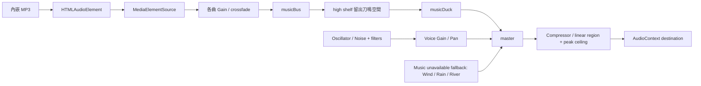

# 素材、動畫與音訊管線

**IMPLEMENTED** 是目前程式；**PLANNED** 是下一次有需求時的接點；**OPTIONAL** 不代表承諾。程式授權與依賴政策見 [SECURITY_DEPENDENCIES](SECURITY_DEPENDENCIES.md)。

## IMPLEMENTED：來源與單檔發行

| 素材 | 可編輯來源 | 發行時的形式 |
| --- | --- | --- |
| 戰場、人物、姿勢、粒子、立繪 | `src/render.js` 的 `RiftRenderer` | Canvas 2D 程序繪圖，沒有外部圖片 |
| Logo、裝具圖示、favicon | `src/shell.html` | inline SVG／data URL |
| 背景與 UI 紋理 | `src/shell.html`、`src/render.js` | CSS gradient／Canvas |
| 常駐音樂 | `assets/audio/music/ambient.mp3` | `#rift-music-data` 的 base64 data URL |
| 戰鬥音樂 | `assets/audio/music/battle.mp3` | 同上 |
| 刀鳴、打擊、危險提示、環境聲 | `src/audio.js` | Web Audio 即時合成 |
| 字型 | `src/shell.html` 的 `--serif`、`--sans` | 系統字型 fallback；不是下載 Noto 字型 |

`python3 scripts/build.py` 將這些來源和 vendor 組成根目錄 `index.html`。開發時可分檔，發行仍單檔。不直接編輯產物內的 base64，也不從舊雲端工作目錄取得素材；clone repository 即可重建。建置詳見 [DEPLOYMENT](DEPLOYMENT.md)。

兩首 MP3 是使用者提供的原檔，本次收編不轉碼：

| 檔案 | bytes | SHA256 |
| --- | ---: | --- |
| `ambient.mp3` | 4,967,689 | `978bf0185269d969b5a4a155dbdd19bdd77b7bd06830b246a866d0556aed1ca4` |
| `battle.mp3` | 5,454,600 | `13bbc67bbfd1be87ac67c54809b451a2514838904bff139b572d48298efc9ff1` |

本表是現有素材身分，不是永久禁止替換。替換後同步 hash 與授權來源說明。使用者提供不等於已有可再授權／商用證明；repository 沒有授予這兩首歌或整個遊戲開源授權。新增第三方素材時記錄作者、取得網址／日期、license、修改情形與再散布條件；保留授權文字。不要把參考圖當作可直接再散布素材。

## IMPLEMENTED：動畫與表現

`RiftRenderer.player(p, alpha)` 根據 FSM `state`、`st`、`move.kind`、速度與狀態旗標選擇身體和刀的姿勢。`portraitFigure` 與 `drawLobbyPortraits` 畫準備介面人物；尺寸不變時快取立繪。`slashes`、`particles`、`parry`、`execution` 等函式畫戰鬥效果。沒有 sprite sheet、骨架播放器、animation clip registry 或動畫資產匯入器。

核心碰撞與招式 active 幀在 `Game`／FSM 決定。畫面插值、呼吸與衣擺使用渲染時間，不能回寫攻擊幀數；相機 `world.camera` 是目前 renderer 的一個明確寫回例外。新增姿勢時先保留 hitbox 與 gameplay state，測試影片不能取代固定幀邊界測試。

**PLANNED**：首次需要可重用 clip 時引入 presentation `poseId`，例如 `idle`、`walk`、`attack_light_startup`、`attack_light_active`、`hit`、`downed`、`revive`、`death`。FSM 提供 pose hint，renderer 消費 hint；不能讓「某張圖播完」成為網路命中真實來源。新素材 ID 遵循 [DEVELOPMENT](DEVELOPMENT.md)；顯示名稱與穩定 ID 分離。

## IMPLEMENTED：音訊路由

- `setScene('ambient'|'battle')` 只在兩個場景間轉場，未使用「每 Boss 一首」的 registry。對局中是 battle，其他 phase 是 ambient。
- 兩曲 `loop=true`，用 media element 避免一次解碼兩段完整 PCM；切走的曲目淡出後暫停，切回保留播放位置。
- 4.2.0播放有效BGM時不再疊加風／雨／河流白噪聲；三層預設零音量，曲目載入中也保持安靜。只有選定曲目缺失／報錯且音樂音量大於零，才啟用合成氛圍／太鼓fallback；曲目恢復後淡出。音樂滑桿設零不會反而打開底噪。
- master後的WaveShaper在正常振幅（±0.8內）為線性，只對較高峰值做連續soft knee、封頂±0.92，保留密集SFX保護，避免全天候atan對音樂染色。不是對MP3做降噪或重新編碼。
- 原常駐曲metadata含Rain and Vinyl Crackle，可能本身包含雨聲／黑膠聲；保留原檔hash。調查未發現原檔數位削波，不能推論所有實體手機聽感正常。
- `setVolume` 是總音量；`setMusicVolume` 獨立控制音樂並保留混音餘裕；`setMuted` 控制整體。尚無獨立 SFX、UI 或環境音量設定。
- `setSuspended` 在背景／本機暫停時停止音樂並關閉 master 輸出；不是停止所有遊戲網路流程。
- `sfx('deflect'|'danger'|'bladeCounter'|'finisher'|'lightning'|'lowHealth', …)` 暫時降低 music gain。其他效果沿用 `sfx` switch；目前沒有通用 UI click 音系統。
- `start()` 必須在可信手勢內同步啟動 `resume()` 和 `play()`；不要先 `await resume()` 再播放，也不要用未完成 promise 阻擋下一次手勢。iOS 恢復和測試限制見 [PLATFORM](PLATFORM.md)。

## PLANNED：新增資源的最小擴充

新增單一素材先擴充現有函式／manifest，不建立空的十幾個資料夾。有實際檔案時才建立 `assets/characters/`、`assets/backgrounds/`、`assets/ui/`、`assets/effects/`；音樂維持 `assets/audio/music/`，未來確有錄製音效才加 `assets/audio/sfx/`。字型若從外部改成本地內嵌，需連同授權、subset 與大小審查。

新增第三首 Boss 音樂需要同一提交完成：build 曲目清單 → embedded music keys → `RiftAudio._ensureMusic/setScene` 的允許清單 → encounter 的選曲呼叫 → 淡入淡出／取消／mute 測試。只放一個 MP3 不會自動被載入。選曲需求達三首以上時再抽 music manifest，scene 使用 stable track ID；保持音訊缺失不阻斷戰鬥。

新增合成 SFX：在 `sfx` 加明確名稱、voice 時長和 rate limit，使用 `_tone/_noise/_source` 管理生命週期，必要時 duck。禁止每 tick 無限制建立 oscillator，也不要改動 `master` 規避音量設定。操作配方與驗收見 [CONTENT_COOKBOOK](CONTENT_COOKBOOK.md)，效能限制見 [PLATFORM](PLATFORM.md)。
