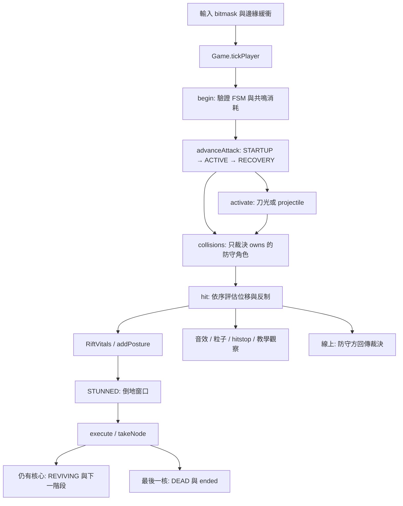
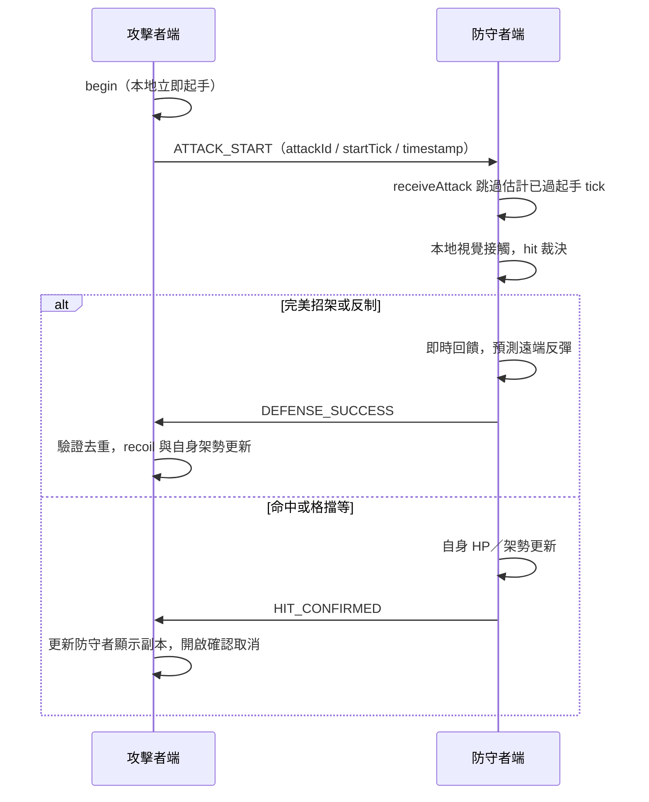

# 戰鬥系統

狀態：**IMPLEMENTED** 的內容依 `4.2.0` 程式；**PLANNED** 是演進接口，**OPTIONAL** 須有玩法需求才實作。幀均指 60 Hz 邏輯 tick，不能換算為 `requestAnimationFrame` 次數。

真實來源：[src/core.js](../src/core.js) 的 `MOVES`、`Game.begin / advanceAttack / tryStomp / collisions / hit / counter / execute`；[src/fsm.js](../src/fsm.js) 的 `RiftFSM`；[src/vitals.js](../src/vitals.js) 的 `RiftVitals`。招式定義與新增程序見 [ABILITY_SYSTEM.md](ABILITY_SYSTEM.md)，Boss 決策見 [BOSS_SYSTEM.md](BOSS_SYSTEM.md)。

## IMPLEMENTED：從輸入到結果

`activate()` 生成表現與投射物，不直接扣對手 HP。近戰接觸集中在 `collisions()`，其迴圈以防守者為單位；`hit()` 入口再次檢查 `owns(target)`。本機模式同一個引擎擁有雙方，線上各端只擁有自己。例外傷害來源是自己的燃燒、帶電落地，以及主機發布的天雷位置；這些仍只修改本端擁有的角色。

### 命中範圍、波次與攻擊生命週期

- 近戰：攻擊者須為 `ACTIVE`；`dx = (target.x - attacker.x) * facing` 在 `[-32, reach)`，垂直差預設 `< 100`。重鎚垂直容許 `< 150`，返雷 `< 700`。目前沒有真正的逐骨骼 hitbox、牆遮擋或多目標搜尋。
- 飛輪：速度 18 px/tick，存活 100 tick；接觸為水平差 `< 27`、相對角色中心 `y - 43` 的垂直差 `< 43`。命中後消失；`reflected` 欄位存在，但沒有反射飛回的行為。
- `p.hits` 避免一個 active 波次重複打同一人；`waves` 開啟新波次時清空。多波招式各波只在 `hitWindow=6` tick 內可接觸；`contactActive()` 同時約束近戰與交鋒，波間不會補打遲進範圍的角色。攻擊 `attackId`、波次 `wave`、`contactId` 讓線上確認去重。不可只靠畫面動畫判斷一次命中。
- 雙方同時揮普通 `slash / cleave` 且朝向、距離有效時，先處理交鋒：每個本端防守者增加 8 架勢，凍結 6 tick；不是完美招架。先快照雙方攻擊，避免一人的崩解清掉另一人的判定。
- 開始別的狀態時，`RiftFSM.enter()` 清除已取消的 `move / attackId / hits / charge / confirm`。不要直接設 `state` 繞過它；網路 replica 與教學重置的直接賦值是既有受限邊界。

### 防禦裁決的實際順序

`Game.hit()` 的順序是玩法規則，調整順序即是平衡變更：

| 優先序 | 條件 | 結果 |
| --- | --- | --- |
| 1 | 非本端角色、死亡、`EXECUTING / REVIVING / DEAD` | 不裁決 |
| 2 | `blinkWindow > 0` 且未倒地 | 消耗影匣窗口，移至背後，自動 `blink` 出刀，12 tick 無敵 |
| 3 | 突刺＋朝攻擊者方向墊步 | 踏刃；攻擊者增加自身架勢上限的35%、`BLADE_PINNED` 42 tick |
| 4 | 橫掃＋空中且腳位高於攻擊者 28 px | 躍過，無 HP 傷害 |
| 5 | 雷斬＋空中 | 接雷：`charged = 180`，不立即扣血 |
| 6 | 普通攻擊＋`invuln > 0` | 閃避；危險招式不受一般墊步無敵化解 |
| 7 | 普通攻擊＋有效招架窗口＋正面或輪盾 | 完美招架 |
| 8 | 普通攻擊＋格擋＋正面或輪盾 | 普通格擋 |
| 9 | 以上皆否 | `RiftVitals.hurt()`，再套用燃燒、擊退、命中回饋 |

`thrust / sweep / lightning / reversal` 都屬危險招式：目前不可普通格擋，也不可完美招架。長按攻擊的 `charged` 顯示為「蓄刺」，使用普通 `pierce` 判定：只有一次命中，可格擋／招架、可由一般墊步無敵閃避，不觸發踏刃或破普通格擋。專用突刺 `thrust` 仍保留危險判定與踏刃反制。輪盾是全方向的普通防禦，**不是所有危險招式無條件無效化**。天雷另外在 `weatherTick()` 處理，輪盾可擋地面天雷；不能將此例外擴張成所有雷斬都能擋。

### 招架與格擋

- `GUARD` 上升緣在中立／格擋／招架／收招／普通受擊／反彈狀態可緩衝8 tick，合法時建立 `DEFLECT`。有效窗口 `max(12, 16 - 2 * guardSpam)`，基礎16 tick、下限12 tick；只有距上次招架嘗試 `<12` tick 且該次未成功時才累加空按債務，上限2。成功招架或較長間隔重置為0。
- 進入 `DEFLECT` 時以當次窗口長度設鎖；成功後消耗窗口、將剩餘鎖縮至最多2 tick，下一波須重新按下。合法新按可在 `DEFLECT` 重新起窗。重複按鍵不能取消 `STARTUP / ACTIVE / DRINKING`。正面條件 `(attacker.x - target.x) * target.facing >= -16`，輪盾忽略朝向。
- 完美招架不扣自身 HP、不增加自身架勢；反給攻擊者 `move.posture * 1.55 + 7` 架勢，普通反彈硬直18 tick，重鎚64 tick；觸發8 tick hitstop。Boss多波招式在非末波被招架時仍累積架勢、保留攻擊時鐘，末波才反彈；架勢崩解與踏刃等特殊反制仍能提早中斷。PvP被招架維持反彈。
- 普通格擋一般不扣 HP：架勢增加 `move.posture * 1.35`。`breakGuard` 招式對普通格擋增加防守者的 `maxPosture`，直接崩解。輪盾優先改成 `move.posture * 0.2`，因此輪盾可承受破普通格擋的攻擊。
- 裂斬可普通格擋、可逐波招架，普通格擋沒有穿透HP傷害；仍依上式承受架勢。52 tick起手、兩波相隔24 tick，各有6 tick接觸窗。紫色刀身、逐波收刀／放刀與「裂斬・可招架」提示使用攻擊時鐘，hitstop時不提前進到下一個提示。

### 蹬踏、返雷、取消

空中重新按下跳躍會建立 `stompBuffer=12`，由 `tickPlayer()` 每個combat tick呼叫 `tryStomp()` 判斷，hitstop不消耗緩衝。按住第一次跳躍不會自動蹬踏；12 tick內必須進入有效範圍：在對手上方20–240 px、水平差 `<=170`，且對手的 `sweep` 位於 `STARTUP / ACTIVE` 或 `RECOVERY` 的前18 tick。此處的前18 tick以判定時 `enemy.st <= 18` 為準。

成功時向對手頭頂輔助靠近：水平位移最多140 px，腳位移至 `enemy.y-90`，再以 `vy=-13` 向上彈跳；不用精準對齊頭頂。`tryStomp()` 先檢查兩人腳位間的線段是否穿過平台，避免隔著平台吸附到對手。反制仍走共用 `counter()`，反給對手架勢上限的30%與35 tick反彈，由防守者自身輸入循環提出；線上裁決權限不變。

`stomp` 限制每次滯空成功一次，`lastStompAttackId` 另阻止落地後重播同一橫掃再次獲得反制。落地清除 `stomp / stompBuffer`，新的橫掃才可再反制；緩衝逾時、受擊鎖定或新按攻擊／裝備／奧義／治療／墊步／掛索都會清除待執行蹬踏。蹬踏只允許自由行動或 `RECOVERY && confirm > 0` 的既有取消；跳躍可離開 `DEFLECT` 並放棄招架窗口，但不解除起手、有效段或飲藥承諾。設計理由見 [ADR-005](adr/005-stomp-assist-and-charged-thrust.md)。

接雷後在空中攻擊會清掉電荷並發動 `reversal`；帶電落地則自身受 26 HP、25 架勢與 75 tick 硬直。actor的 `charged` 欄位是帶電旗標數值（與 `MOVES.charged` 招式ID不同），沒有一般逐 tick 的 180→0 倒數；只有釋放、落地、復燃等路徑清除。不要誤把它文件化為三秒自然到期。

命中後 `confirm` 開啟收招取消：本機命中 28 tick、普通格擋 22 tick、同時交鋒 25 tick；線上 `HIT / BLOCKED` 回覆給 28 tick。`RECOVERY && confirm > 0` 可接 `combo` 或墊步，亦允許跳躍，空中成功蹬踏時會結束收招。完美招架通常把攻擊者改為 `RECOIL`（上述Boss非末波例外），不能當成一樣的連招確認。飛輪激活便建立 `chase = 95`，**不是只有飛輪命中才可疾斬**；教學額外要求兩者確實命中才算完成課程。

另外 `light / combo / chase / air` 在收招經過6 tick後可防禦取消，不需命中確認。長按防禦只轉普通格擋；最近8 tick內的新按才取得招架窗。重招、起手、有效段與飲藥不走這條取消路徑。

## IMPLEMENTED：角色容量、修復與核心

actor持有 `maxHp / maxPosture / maxNodes`；`RiftVitals` 提供同名容量helper及 `hpRatio / postureRatio`。玩家、同屏／線上PvP、陪練維持 **100 HP／100架勢／2核**；只有 `Game.start('ai')` 的赤衡套用 `BOSS_PROFILE`：**240 HP／220架勢／3核**。這是既有fighter的容量接點，尚無通用Stats／Boss registry；設計理由見 [ADR-004](adr/004-readable-rhythm-and-boss-capacity.md)。

| HP占自身上限比例 | 自然架勢恢復速率 |
| --- | --- |
| `>= 75%` | 35架勢點／秒 |
| `50% <= hp/maxHp < 75%` | 15架勢點／秒 |
| `< 50%` | **0／秒** |

`RiftFSM.postureRate()` 另要求距最近接觸至少 12 tick (`peace >= 12`)，排除倒地、執行、復燃與死亡。持續 `GUARD` 且水平距離 `> 350` 時 ×2.5；燃燒 ×0.25；AI第二、三階段 ×1.2。低 HP 的 0 在乘數前返回，不能被任何上述倍數變成非零。`tickPlayer()` 的提早返回也使飲藥與受擊鎖定時不進行常規恢復。

`RiftVitals.beginDrink()`：落地、可自由行動、HP < `maxHp`、至少一劑才可使用；立即消耗 1 劑並鎖定 `DRINKING` 54 tick，完整完成後恢復 `maxHp * 40%`，上限 `maxHp`（玩家40、赤衡96 HP）。受傷／反應轉移清空 `healPending`，已消耗的藥不退還。初始 3 劑，任何一次復燃都不補藥。

`hp <= 0` 或 `posture >= maxPosture` 只觸發 `down()`：HP降到至多 `maxHp * 15%`、架勢填滿上限、清掉橫向速度／墊步／掛索／防禦，進入 `STUNNED` **240 tick／4 秒**。空中仍有重力。重複打已倒地者不延長原有狀態計時。窗口結束 `recoverDown()` 回到15% HP、35%架勢與 `IDLE`（玩家15／35、赤衡36／77），沒有自動扣核。

貼身攻擊觸發 `execute()`：本機水平 `< 135`、垂直 `< 115`，且目標 `vulnerable()`。`takeNode()` 每次只奪一核：

1. 仍有核心：HP=`maxHp`、架勢=0、Phase=`maxNodes - nodes + 1`、`REVIVING` 與 invuln=90 tick，清除燃燒／帶電／附火等；對手震退，繼續同一場。赤衡前兩次斷決分別進Phase2／3，第三次才結束；玩家仍為第二次結束。
2. 剩 0 核：`DEAD`，`finisherScene()` 將 `world.phase='ended'`、增加場次比分，約 1.6 秒後顯示結果。

不要讓任意「傷害事件」直接觸發勝利，或讓每幀輸入在倒地時保留逃跑速度。

## IMPLEMENTED：狀態效果與傷害限制

| 現有概念 | 實作位置與語意 |
| --- | --- |
| 燃燒 DOT | `burn=240`；`tickPlayer()` 倒數後每逢 `%45===0` 受 1.5 HP；重複命中覆寫時長，不疊層；架勢恢復 ×0.25 |
| 附火 | 焰筒開始時 `fireReady=180`，其間發動 `light` 轉 `fireBlade=600`；命中可施加燃燒 |
| 硬直 | `HIT_STUN / RECOIL / BLADE_PINNED / STUNNED` 明確狀態；一般命中18、重鎚32、雷斬75、返雷110 tick |
| 霸體 | `STARTUP && move.armor` 抵抗普通受擊狀態中斷；重鎚及所有Boss起手套用，仍扣HP／架勢，崩解或特殊反制仍中斷 |
| 擊退 | 普通命中速度6、重鎚10，`HIT_STUN` 每tick乘0.75；倒地強制清零 |
| 恢復 | 修復劑單次延遲恢復40%上限HP；雙斷每個成功命中清除自身 **50 架勢點**，不是當前值50% |
| 無敵 | 墊步7 tick，影匣成功12 tick、復燃90；一般危險招式繞過墊步 invuln，復燃狀態則拒絕接觸 |

目前沒有物理／魔法區分、暴擊、護甲、抗性、毒／冰／流血、HOT、通用 Buff 容器、裝備增傷、友軍、爆炸半徑或碰撞分層；`rift / reversal` 是長範圍近戰條件，不是通用 AOE 系統。

## IMPLEMENTED：線上裁決與時序

[src/authority.js](../src/authority.js) 的 `RiftAuthority` 驗證擁有者、回合、ID、型別與數值界限；[src/net.js](../src/net.js) 是可靠 JSON DataChannel transport，通訊版本 `5`，拒絕版本4等舊版的連線／封包（與遊戲版本無關）。穩定ID `charged` 的語意已從雙波蓄斬改為單次普通蓄刺，不能讓兩種裁決規則互連；理由見 [ADR-005](adr/005-stomp-assist-and-charged-thrust.md)。

- `_elapsed()` 用 `Date.now() + clockOffsetMs - timestamp`，換成 60 Hz tick，截在 0–30 tick；不是單純把不同裝置時鐘直接相減。Ping/Pong 用 RTT 中點估計偏移，非完美時鐘同步。
- `publishState()` 最多20 Hz；`receivePlayerState()` 預測最多12 tick，位置誤差較小時按0.65插值，大於170px時貼齊。只改遠端副本，不倒退已由意圖建立的攻擊時鐘。
- 放開蓄力透過 `ATTACK_RELEASE`；`startTick` 用來避免較晚收到放開訊息而把輕斬誤認成蓄刺。
- 完美招架凍結雙端各自8 tick。`step()` 凍結時暫停角色／碰撞／`world.tick`，繼續收集輸入上升緣與處理表現。網路 callback 仍可到達；**沒有完整 rollback、歷史世界重播或延遲保證**。AI模式在hitstop期間沿用前次input bits，不呼叫 `RiftAI.input()`；視覺歷史與AI排程一同凍結。
- `FINISHER_REQUEST` 由被處決者再次驗證脆弱與距離（160／120容許），只有其端 `takeNode()`；確認回覆才改另一端顯示與結局。
- `attacks / remoteAttacks / results / controls` 去重與容量上限避免重送多扣血。這是互信 P2P，一個惡意防守端仍可謊報；不要宣稱具伺服器權威的競技防作弊。
- HUD 序號缺口是可靠通道訊息缺口估計，**不是 UDP 丟包率**。既有 `sendInput / sendSnapshot` API 未被現在 `Game.frame()` 當作主同步路徑。

## PLANNED：逐步抽出純裁決，不重寫玩法

當第二個內容需求真的需要修飾傷害時，先把 `Game.hit()` 的數值結果抽成 `resolveContact(context) -> CombatResult`；保留上面的防禦順序與 `owns()` 邊界。建議結果只包含 `damage / postureDelta / reaction / effects / attackCancelled / events`，由擁有者一次套用；渲染與音效讀結果，不能再次扣血。

未來資料流程：`AttackSpec → TargetQuery → DefenseResult → ModifierPipeline → StatusApplications → VitalsChange → DefeatRule → DomainEvent`。先只實作所需的修飾器；新增元素或裝備時才補 `damageType / tags / modifiers`。修飾順序須固定並有公式測試，例如基礎值→攻擊者加成→暴擊（若需要）→防禦抗性→防禦結果→夾限；不能讓 UI 或 Boss AI 各算一次。

狀態效果的提案生命週期：`apply → tick → refresh/stack → expire → remove`。最小實例 `{id, sourceId, remainingTicks, stacks, nextTickAt}`，定義表負責 `durationTicks / maxStacks / refreshPolicy / tickInterval / modifiers`。先用現有 burn 做一次等價抽取；凍結期間不扣狀態時間，復燃清除策略要明列。不要把控制 FSM 與可同時存在的 Buff 混成一個巨型狀態枚舉。

**OPTIONAL**：物理／魔法、暴擊、護甲、抗性、HOT、AOE、裝備互動都待玩法確認。若添加多人／多敵人，先完成 [ENEMY_SYSTEM.md](ENEMY_SYSTEM.md) 的 target 與 authority 遷移，不能把 `1 - player.id` 搬到新系統。

## 修改後必測

以 [TESTING.md](TESTING.md) 的命令與 [REGRESSION_CHECKLIST.md](REGRESSION_CHECKLIST.md) 為準。針對本系統需驗證：起手／有效段／飲藥不可轉防禦；16→12 tick窗口及成功重置；8 tick緩衝與6 tick輕招收招取消；HP比例49%／50%／75%邊界；倒地不滑動且4秒後恢復；玩家雙核與Boss三核；飲藥第53/54tick及中斷；各波只命中一次且波間不命中；Boss非末波可連續招架、末波反彈；裂斬格擋無chip；蓄刺單次命中且可擋／招架、專用突刺仍可踏刃；蹬踏12tick緩衝／18tick收招容許、範圍與平台遮擋、每次滯空與attack ID去重、行動鎖及防禦轉跳；霸體仍能崩解；100/200ms模擬兩端權限、重送與舊回合；60/144/240Hz下同樣邏輯步數。視覺／音效測試不能代替數值與權限測試。
