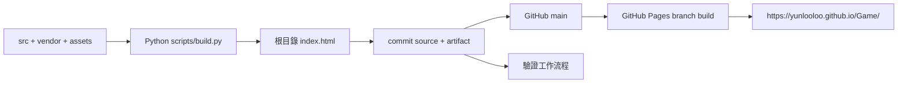

# 本機、建置與部署

本文件是部署操作唯一主要來源。遊戲版本、資料版本與 Git commit 各有不同意義，見 [DEVELOPMENT](DEVELOPMENT.md)。

## IMPLEMENTED：目前實際流程



- Repository：`https://github.com/Yunlooloo/Game`，發行版本由 [PROJECT_STATUS](PROJECT_STATUS.md) 維護。
- Hosting：GitHub Pages。2026-10-05 唯讀 API 確認 `build_type=legacy`、`source.branch=main`、`source.path=/`，沒有 custom domain。
- 本次架構收編前，Pages `built` commit 是 `e5847fa279a49a92b0f7fc296dfe052b751648b2`。這是審核基準，不是要求永遠部署這個 hash；每次發布都要查最新 commit。
- 目前 branch publishing 自動由 GitHub 建置，無遊戲 backend、runtime npm install、Vite／Webpack、Vercel、Netlify 或 Firebase。
- repository 的驗證 CI 不上傳或部署 Pages artifact。推入 main 會啟動 Pages，**CI 不是 Pages 的發布閘門**；因此直接 push 前必須本機驗證。規模需要時才用 required checks／Actions deployment，參見 ADR。

## 本機啟動與 production build

先具備 Python 3.11+、Node.js 22+。可直接用現有 `index.html` 玩；修改來源後要重建。

```sh
python3 scripts/build.py
python3 scripts/check.py
python3 scripts/test.py
python3 -m http.server 8000 --bind 127.0.0.1
```

開啟 `http://127.0.0.1:8000/`，離線 AI／同屏內容不需要對外服務。HTTPS production 或 localhost 是建議測試方式，避免 `file://` 的儲存與剪貼簿差異。伺服器在終端以 Ctrl+C 停止。端口占用可改為 8001。

`build.py` 是 production builder；沒有另一套 dev／production 遊戲邏輯、壓縮服務或需要 `.env` 的步驟。`python3 scripts/build.py --check` 只比對產物是否與來源一致，不修改 HTML。若失敗，重新 build 後查看 source 和產物 diff；不能以手改產物通過。

瀏覽器 smoke 的安裝、命令與實際涵蓋範圍以 [TESTING](TESTING.md) 為準。輸入、聲音、Canvas 或流程改動至少執行 `python3 scripts/test.py --browser` 並檢查適用的實機清單。

## Preview

**IMPLEMENTED**：在功能分支／獨立 checkout build，使用上述 localhost 靜態伺服器；若需讓手機測試，使用受控、可信的 HTTPS preview 主機或開發環境提供的安全轉送功能。不要為測試而關閉 TLS 驗證或公開工作區根目錄。

**PLANNED**：只有團隊確實需要 PR preview 才增加；目前沒有每個 branch 自動公開網址。不要把 preview branch push 說成已更新正式站。

## 發布

1. 讀 `git status --short`、目前 branch 與遠端設定，確認此工作得到部署授權。
2. build、check、unit 和適用 browser／人工 regression；查看 `git diff --check`。source、素材與 `index.html` 一起提交，不提交測試快取或憑證。
3. commit 後 push main。若工作分支名稱不同但此任務已明確授權直接更新 main，可用 `git push origin HEAD:main`；不要 force push。若 remote 有新提交，先整合並重測。
4. 查 CI 和 Pages（需已登入且具讀取權限的 `gh`；不可將 token 放在命令、文件或遊戲中）：

```sh
gh run list --limit 5
gh api repos/Yunlooloo/Game/pages --jq '{status,source,html_url}'
gh api repos/Yunlooloo/Game/pages/builds/latest --jq '{status,commit,error}'
git rev-parse HEAD
```

5. Pages build 顯示 `built` 且 commit 是預期 revision，再開啟公開網址。HTML 通常約 14 MB，回傳 HTTP 200 不代表內容已更新；比較下載 bytes/hash 更可靠。

```sh
python3 - <<'PY'
from pathlib import Path
import hashlib, urllib.request
expected = Path('index.html').read_bytes()
url = 'https://yunlooloo.github.io/Game/?verify=' + hashlib.sha256(expected).hexdigest()[:12]
with urllib.request.urlopen(url, timeout=120) as response:
    assert response.status == 200
    actual = response.read()
assert actual == expected, 'Public HTML differs from local artifact'
print('Verified public HTML:', len(actual), hashlib.sha256(actual).hexdigest())
PY
```

6. 瀏覽器確認大廳、開聲音、移動、戰鬥、勝敗重開；UI 變更檢查手機橫直向。記錄 commit／瀏覽器／裝置／測試結果，明列未實測項目。網址加 `?v=4.2.0` 可避開既有 HTML cache，但不取代比對內容。

CI 狀態、Pages build 和網頁實際內容是三個不同證據；不要只看到 push 成功就宣稱已上線。雲端執行環境設定的 Publish 與 GitHub Pages 發布也是不同操作。

## Rollback

**IMPLEMENTED 操作方式**：保留歷史，以新的 rollback commit 回退，而非重寫 main。先查最近成功部署 commit 與本次變更範圍；通常 `git revert <bad-commit>`，重新執行 build/check/test，再 push 並驗證公開內容。不要只還原 `index.html` 留下不匹配的 source。

本次來源收編之前的 revision 只有 HTML。若必須回退到這種版本，需明確把它當「舊單檔版緊急回退」，不能宣稱新來源可重建它；記錄後續復原方案。從有 source 的 revision 開始，優先回退完整 source＋artifact。

**PLANNED**：引入正式存檔 schema 或網路協議改版時，release note 必須列出 rollback 的讀取相容性與玩家處理方式；存檔 migration 不可藉 rollback 靜默抹除。見 [SAVE_SYSTEM](SAVE_SYSTEM.md)。
