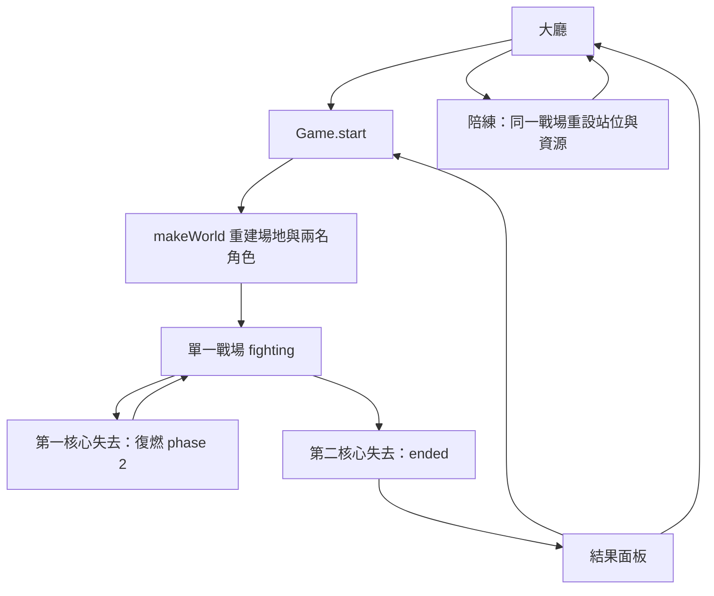
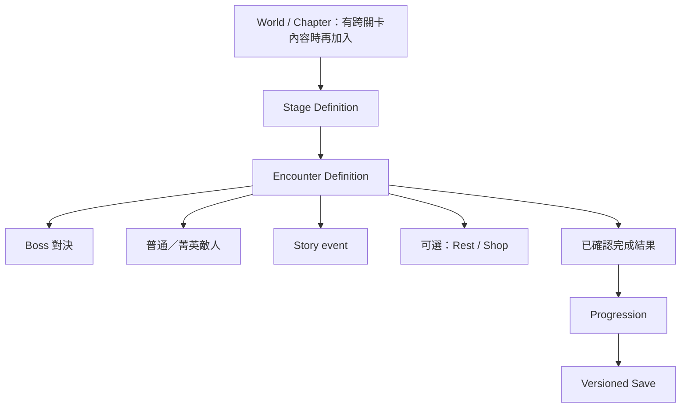

# 世界、關卡與 Encounter

狀態：單一競技場為 **IMPLEMENTED**。本文件的 Stage／Encounter 定義、選關與獎勵接口為 **PLANNED**，尚未實作；商店／休息點是否加入屬於 **OPTIONAL**。

## IMPLEMENTED：現在只有一張戰場

`src/core.js` 的 closure-local `makeWorld()` 建立完整新對局，`Game.start(mode, config)` 使用它。沒有 `SceneManager`、Stage ID、關卡載入器或跨場景進度。`mode` 為 `ai`、`local`、`online`、`tutorial`，不是關卡 ID；`world.phase` 是 `menu/fighting/ended`，也不是 Boss 的 `fighter.phase: 1/2`。

地圖按 **4000 × 1200** 設計，但沒有統一的 `world.width/height` 設定。實際碰撞水平邊界是 x=24…3976、頭頂限制 y≥72，最底地面 y=1080；`Game.physics()`、投射物、renderer 相機／背景等多處仍使用固定值。1200 是設計高度，不是可直接改一個欄位的邊界。

| 平台 index | x | y | w | type |
| --- | ---: | ---: | ---: | --- |
| 0 | 0 | 1080 | 4000 | `stone` |
| 1 | 280 | 870 | 600 | `bridge` |
| 2 | 1130 | 920 | 420 | `stone` |
| 3 | 1570 | 810 | 890 | `bridge` |
| 4 | 2640 | 905 | 650 | `bridge` |
| 5 | 460 | 600 | 480 | `gantry` |
| 6 | 1160 | 470 | 450 | `pylon` |
| 7 | 1710 | 465 | 640 | `gantry` |
| 8 | 2750 | 540 | 610 | `gantry` |
| 9 | 2160 | 220 | 390 | `pylon` |

9 個掛索錨點是 `(420,765)`、`(730,510)`、`(1300,382)`、`(1680,700)`、`(1900,373)`、`(2390,126)`、`(2650,785)`、`(3010,450)`、`(3440,780)`。玩家及對手出生於 `(1810,810)`／`(2150,810)`，面向彼此。掛索選擇高於自身 45 px、距離小於 850 px 的錨點，反向錨點有距離懲罰；AI 的 `_selectedAnchor()` 刻意遵循同一規則。

地形及互動：

- 平台是單向落地判定；`S + jump` 可穿過非底層平台，不是完整 tilemap／牆壁碰撞引擎。
- `crystalReeds` 有 22 個可斬斷物件，位於 `x=240+i*167, y=1080`；`doors` 有 3 個可撕裂物件。它們在 `Game.activate()` 判斷破壞，在 renderer 畫出；不是會阻擋角色的動態剛體。
- 低層下蹲可隱藏身形。地形遮擋與 AI 視野不是通用 visibility graph。
- renderer 背景、晶簇、雨、遠景、角色皆為 Canvas 程式繪製；沒有外部地圖圖片。
- `RiftAI._route()` 對平台與錨點做小型路徑搜尋，支援落下、跳躍、掛索；地圖改動必須驗證高低差，不能只測同層追擊。

### 天候

`world.weather` 為 `dusk` 或 `storm`；大廳／戰鬥可切換。雷雨的 `weatherTick()` 按固定步進倒數：初始 360 tick，倒數到 70 標記其中一名角色當時位置，0 時落雷，之後重置為 360–659 tick。落點附近空中角色可接雷；地面未展盾者受傷。線上由房主發出天候／落雷事件，但各端仍只結算自身角色的受擊。隨機天候不是跨端 deterministic replay 的保證。

### 對局生命週期



`scores` 只存在此次頁面執行的 `Game` 記憶體中。重開對局重設可破壞物，沒有通關後前往下一關、拾取獎勵或保存場地破壞。

## PLANNED：分開 Stage 與 Encounter

需求順序應是第二個競技場 → 可選 Stage Definition → 必要時多 Encounter；不先建立世界地圖系統。Stage 描述場所及組成；Encounter 描述當次戰鬥／事件和完成條件。



以下示例僅為將來的資料契約，沒有對應 loader：

```js
// 未來 src/content/stages/foundry.js
const foundry = {
  id: "stage_foundry",
  name: "斷鑄場",
  bounds: { width: 4000, height: 1200, groundY: 1080 },
  platforms: [/* 首次抽取 makeWorld 的原資料，值與順序不變 */],
  anchors: [],
  spawns: [{ x: 1810, y: 810 }, { x: 2150, y: 810 }],
  backgroundId: "background_foundry",
  defaultWeather: "dusk",
  musicId: "battle",
  requirements: [],
  encounters: [{
    id: "encounter_foundry_chiheng",
    kind: "boss",
    bossId: "boss_chiheng",
    onComplete: { storyEventId: null, rewardId: null }
  }]
};
```

以上平台省略內容不能當可執行資料使用。既有音樂 ID 是 `ambient`／`battle`，先保留；其餘 ID 是新增規範示例，不代表現在已註冊。第二競技場最初沿用相同世界邊界和兩名對戰者，降低改動面。

### 首次整合的真實接點

1. 新增 `src/content/stages/foundry.js` 與 `src/content/stages/registry.js`，只搬靜態場地資料；`makeWorld()` 必須複製每局可變陣列，不能共享上一場的 `cut/torn`。
2. 讓 `makeWorld()`／`Game.start()` 接受經驗證的 Stage ID，缺省仍建原戰場；將模組加進 build 順序。註冊表沒有接到 `start()` 前，新增檔案本身不會生效。
3. 先以 debug 啟動選項驗證第二張圖，再加大廳選單。`RiftTutorial.select()` 目前固定橋面站位與尺寸；第一版教學仍鎖原圖。
4. 任意尺寸需求出現時才統一 bounds，逐一移除 physics、projectile、camera、background、AI 的固定數字，測超寬／窄圖和鏡頭。
5. `EncounterRunner` 首次只包兩人 Boss 對局的開始與完成；`finisherScene(final)` 產生一次完成結果，讓 runner 決定回選單／下一場。不能讓 Boss 直接修改場景 DOM 或頒獎。
6. 多敵人前必須先解除 `players[1-id]`、輸入陣列固定兩格、兩人 HUD、單一 AI 與線上兩個 owner 等假設；見 [ENEMY_SYSTEM.md](ENEMY_SYSTEM.md)。

開始、取消、重試、離開關卡時，要一起清除 input、AI pending action、粒子／projectiles、結果 timer、教學 wrapper 的作用範圍及 Encounter 訂閱。未清除的舊結果不能把新關卡送回結算面板。線上增加 Stage ID 時同時版本化 setup 封包、驗證兩端內容相容，不能只在房主替換地圖。

## 如何新增與驗證

實作步驟見 [CONTENT_COOKBOOK.md](CONTENT_COOKBOOK.md)。Stage 定義校驗：ID 唯一、座標有限、平台寬度正值、spawn 落在可站立地面、錨點可達、引用 Boss／音樂存在。Integration 測試：上下層追擊、落下與掛索、邊界、重開清空破壞、天雷 local authority；新增切關後再加取消／重試／返回、結果只發一次測試。保留原地圖完整回歸，手機直／橫向都能看見兩角色與危險提示。
