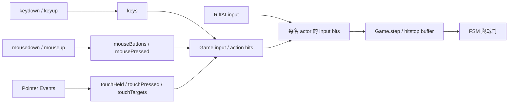

# 平台、輸入、UI 與效能

本文件以 runtime **4.0.2** 的 `src/core.js`、`src/render.js`、`src/audio.js`、`src/shell.html` 與教學 UI 為準。**IMPLEMENTED** 表示存在於程式，並不等於已通過所有裝置驗證。操作故障見 [TROUBLESHOOTING](TROUBLESHOOTING.md)，測試方法見 [TESTING](TESTING.md)。

## IMPLEMENTED：輸入介面

- 主要操作：`A/D` 左右、滑鼠左鍵／`J` 攻擊、右鍵／`K` 招架與按住防禦、`Space/W` 跳、`Shift/L` 墊步。`E`／中鍵使用目前裝具，`Q`／滾輪切換，`R/C` 修復劑，`F` 鉤繩，`O` 戰技。右鍵先按住再點左鍵也可發動戰技。完整第二玩家與進階對應以 `Game.input()` 和遊戲操作卷軸為準。
- 輸入先轉成 `B` bitmask，再由同一 `step`／FSM 執行；按鍵不直接造成傷害。AI 與教學也沿用相同動作路徑。
- `canReceiveInput()` 限定戰鬥、未暫停且無阻擋面板。文字欄位不接收戰鬥快捷鍵；回合開始／恢復時 `focusArena()` 將焦點回到 Canvas。
- `touchHeld` 保留長按；`touchPressed` 保留短按邊緣直到固定 tick 取用，正常 pointerup 不抹除待處理的短按。pointer cancel／非正常 lost capture 清理對應輸入；不同 `pointerId` 可同時移動與防禦。
- `blur` 清空輸入，本機模式暫停；`visibilitychange` 清空輸入及 accumulator。線上模式不提供單方暫停，`Escape`／手機暫停按鈕顯示持續對局提示。
- 戰鬥區的 `touch-action:none`、`user-select:none`、`-webkit-touch-callout:none` 配合範圍限定的事件抑制，避免長按選取。選單／教學仍可捲動，`#room-code` 可輸入及選取。不要改成整個 `body` 禁止觸控，也不能攔截全域 `touchend` 傳遞。

**PLANNED**：需要可重綁按鍵時，抽取 `InputBindings` 與 keyboard/mouse/touch adapter，輸出既有 bits；不要建立第二個 gameplay resolver。輸入配置需同時更新 UI 提示與教學目標。

**OPTIONAL**：Gamepad API 尚未實作。導入時用 dead zone、按下邊緣／長按分離、裝置拔除清理，映射同一 action contract；不能直接把每次 poll 當成新的招架按下事件。

## IMPLEMENTED：UI 責任與限制

| 介面 | 現有來源／行為 |
| --- | --- |
| 準備、大廳、裝具、天氣、房間 | `src/shell.html`，`Game.bind/updateLoadout/host/join` |
| HUD、共鳴雙核、狀態、網路指標 | `Game.renderHUD()`，約每 65 ms 更新 DOM；不是每個 simulation tick 更新 |
| 暫停／聲音滑桿／操作卷軸 | `togglePause/showPause/toggleGuide`；本機暫停，線上不暫停對局 |
| 勝敗、重開、回大廳 | `showResult/start/lobby`；沒有獨立 Victory／GameOver scene class |
| 陪練課程 | `src/tutorial.js`、`tutorial-ui.html/css`；觸控操作時收合，課程切換與完成時展開 |
| 背包／對話／商店／完整設定 | **PLANNED**，目前沒有對應 UI 或資料模型 |

目前 `Game` 同時操作 DOM 與 simulation，尚未完全解耦。**PLANNED**：新增實際畫面時先做 `render(viewModel)` 與 `onAction(command)` 邊界；UI 可以要求「使用修復劑」，但不能直接改 `p.hp` 或繞過 FSM。首次有多個事件消費者時再依 [GAME_SYSTEMS](GAME_SYSTEMS.md) 引入 outcome events，不為每個按鈕建立全域 event bus。

## IMPLEMENTED：視窗、DPI 與手機版

- `viewport-fit=cover` 搭配 safe-area insets；Canvas 撐滿戰場，DOM 依媒體查詢調整。粗略指標裝置在戰鬥時顯示觸控區。
- 手機主要左右、攻防鍵為 **64 CSS px**；橫向 **72 px**；粗略指標且寬度至少 900 px 時 **76 px**。輔助鍵一般 **46 px**，上述寬螢幕為 **48 px**。這是 CSS 尺寸，不是物理螢幕像素。
- `RiftRenderer.resize()` 讀取 Canvas 的 CSS bounding box，將主 Canvas 和後製 buffer 依 `min(devicePixelRatio, 2)` 建立 bitmap；最小邏輯尺寸 320×240。DPR 上限限制手機 fill rate 和記憶體成本。
- **已知缺口**：`resize()` 目前只在 constructor 呼叫，沒有 `resize` listener／`ResizeObserver`。CSS 橫直向會改，但 bitmap 和 renderer 的 `w/h` 不會自動更新。旋轉後的鏡頭與畫面比例不能稱已正確支援；暫時在選好方向後重新載入。此限制為 [TECH_DEBT](TECH_DEBT.md) TD-16。
- 沒有 Fullscreen API 按鈕、orientation lock、PWA manifest 或 service worker。瀏覽器本身的全螢幕功能不等於遊戲已實作全螢幕生命週期。

**PLANNED**：修正 resize 時，觀察 Canvas 容器實際尺寸與 DPR，僅變化時重設兩張 bitmap；保持世界位置、fixed tick 與 camera 目標不變。測試必須在**同一局中旋轉／改視窗**，不能只在四個固定尺寸各開一次新頁。加入 Fullscreen API 前先完成這項基礎。

| 驗證層級 | 能證明什麼 | 不能據此聲稱什麼 |
| --- | --- | --- |
| Node simulation／audio mocks | FSM、時間、輸入與受控權限契約 | 真實硬體音訊／觸控行為 |
| Chromium Playwright／CDP touch | 實際 DOM、Canvas、媒體播放與觸控事件 | iOS Safari／Chrome 實機或所有瀏覽器 |
| 模擬 100／200 ms transport | 測試場景中的裁決與封包時序 | 任意 NAT、公用 TURN、真實網際網路可連通 |
| 實體手機與兩裝置網路 | **PLANNED 驗收**，需保留 OS／瀏覽器版本、步驟與結果 | 尚未取得的裝置結果不能由 emulation 補稱 |

目前沒有正式最低瀏覽器版本承諾。Chrome 桌面與 iOS Chrome 不應視為同一測試平台。每次驗證結果及環境以 [VALIDATION](VALIDATION.md) 為準。

## IMPLEMENTED：iOS 音訊契約

音訊資源與混音路由見 [ASSET_PIPELINE](ASSET_PIPELINE.md)。`RiftAudio.start()` 延遲到可信使用者手勢才建立／啟動 context；手勢 callback 內同步發起 `resume()` 與 media `play()`，之後才等待 promise。`suspended` 與 Safari `interrupted` 都需嘗試恢復。

1. 不能用「已有 pending resume」作為忽略新手勢的理由。某次 touch/pointer 事件沒有授權時，promise 可能持續 pending；稍後真正授權的 `touchend` 必須再次嘗試。
2. `touchend`／`pointerup`／`click`／`keydown` 會解鎖；一般 pointerdown 僅接受 mouse。`#sound-button` 使用自己的 handler，首次點擊強制開聲而非反向切成 mute。
3. 支援時嘗試 `navigator.audioSession.type='playback'`，不支援或設值失敗則回退。這不是保證所有 iOS／硬體／靜音開關都相同行為。
4. 每首 HTMLAudioElement 設定 `playsinline`，其 play attempt 編號避免舊 promise 結果覆蓋新一次嘗試。靜音／背景／場景轉換仍走同一 master 和 music bus。
5. 回到前景或 `pageshow` 只嘗試恢復已存在 context；若瀏覽器仍需手勢，讓使用者再點「開啟聲音」。不要繞過 autoplay policy 或重複建立多個 context。

安全診斷入口為 `game.audio.getMusicStatus()`，只回傳狀態、時間及錯誤類型；不能把整段 music data URL 複製到 log。**實體 iPhone 的聲音輸出尚未確認**，即使 Chromium analyser 取得非零樣本，也不能當成喇叭有出聲。

## IMPLEMENTED：效能現況與預算

- simulation 固定 60 Hz，每 render frame 最多補 6 ticks；長背景停頓不會一次補完所有戰鬥。`droppedFrames` 是略過時間的估計值，HUD「60 HZ」表示內部 tick rate，**不是實測 FPS**。
- renderer 每個 animation frame 繪畫，背景物件有可見範圍判斷，普通畫格避免整張後製 buffer 複製；處決與色差效果才快照。立繪依尺寸快取。
- 粒子在 `sparks()` 限制為 550；SFX voice 上限 44，完成後斷接音訊節點。這些是現有局部上限，不是所有 effect 陣列都有統一 budget。
- 單檔約 14.3 MB，兩首 MP3 內嵌 base64 增加約 33% 編碼體積；HTML 字串、JSON 與媒體資源可能共存。HTMLAudioElement 避免主動一次解碼兩首為完整 PCM，不代表零記憶體成本。
- 每 tick 使用 `filter`／短生命週期物件；全畫面 Canvas filter、雙 bitmap、高 DPI 與暴雨可增加手機 GPU／GC 壓力。目前沒有跨裝置 FPS、峰值記憶體或電量基準，不宣稱穩定 60 FPS。

**PLANNED 工程規範**：新增素材回報 source／build bytes 差異；新增粒子／AOE／音效標明數量上限與釋放點。測試至少含閒置、暴雨、密集招架、重開數十次；記錄裝置、viewport、DPR、frame time 分布、heap／voice／effect 數是否持續增長。60 Hz 目標每畫格 16.7 ms 是預算，非現有保證。優先 profile 實際熱點，再考慮物件池、背景快取或品質設定。

**OPTIONAL**：若單檔大小成為實測瓶頸，可依 ADR 評估壓縮音樂或平行提供多檔版本；不能未經需求便破壞既有單檔發行契約。Texture atlas、WebGL 或 engine 遷移目前都沒有必要性證據。

## IMPLEMENTED／PLANNED：無障礙

已有 DOM button、focus-visible、Canvas／控制鍵 aria-label、部分狀態 aria-live、總音量與音樂音量。危險提示同時有視覺與合成聲音，狀態 HUD 也有文字；這些不代表遊戲已符合完整無障礙標準。

**PLANNED**：優先補 reduced motion／camera shake／flash 強度選項，保留招式辨識與時間；重要警示須有形狀或文字，不能只用紅／綠或音調。檢查 modal 焦點管理、鍵盤離開面板、字體放大、對比度與窄螢幕 footer（目前可小至 7 px）。Canvas 戰鬥尚無完整 screen reader 等價體驗。難度／教學輔助需明確標記模式，不可暗改線上判定。

## 設定與開發工具

**IMPLEMENTED**：設定分散於 `core.js` 的 tick／moves、`RiftAudio` 音量、renderer 品質上限、DOM 選配；音量／配裝不持久化。沒有中央 `GameConfig`、feature flags、Boss／Stage selector、God mode、hitbox overlay 或 FPS panel。集中設定的最小演進見 [DEVELOPMENT](DEVELOPMENT.md)。

`window.game.debug` 提供 `start/pause/step/move/hit/setPlayers/snapshot/reset` 與 `bits/moves/states/fsm/vitals`。只在本機診斷／測試使用：`debug.hit` 直接呼叫 resolver，不能當成真實輸入或網路裁決測試；`debug.step` 有固定 tick 但沒有管理所有 RNG，所以不是完整 deterministic replay。`debug.pause` 只改 flag，不等同 `togglePause` 的 UI／輸入清理流程。

**PLANNED**：增加開發模式時讓 Inspector 讀取 snapshot，測試選角走正常 `start`／factory，繪製 hitbox 只讀 collision 資料；God mode 明限本機且不可被存檔或正式 online state 帶入。公開 debug 的信任風險見 [SECURITY_DEPENDENCIES](SECURITY_DEPENDENCIES.md)。
