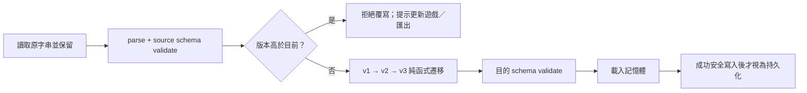

# 儲存現況、Save Schema 與遷移原則

狀態：只有教學完成紀錄為 **IMPLEMENTED**；本文件的統一 Save Schema、SaveService、migration、備份／匯入匯出都為 **PLANNED**；雲端存檔及線上排行榜為 **OPTIONAL**。不要宣稱目前已支援保存對局或永久成長。

## IMPLEMENTED：唯一的儲存鍵

`src/tutorial.js` 的 `RiftTutorial.constructor()` 與 `complete()` 使用：

```text
localStorage key: riftblade-tutorial-v1
JSON value: ["move", "jump", "parry"]
```

它是**字串陣列**，不是有 `saveVersion` 的物件。讀取時以 `LESSONS.some(l => l.id === id)` 過濾已知課程，用 `Set` 去重。解析／儲存失敗由 `try/catch` 吞掉：遊戲仍可玩，錯誤不顯示，也不備份／修復原字串。非陣列值未有完整 schema 驗證，例如不可迭代值會被 catch；不要把此行為當成熟容錯設計。

目前合法課程 ID：

```text
move jump dash grapple light charged combo guard parry posture bladePin
stomp reversal heal disc flame aegis hammer blink cleave rift finisher
```

`bladePin` 是既有保存用 ID，雖不符合未來 snake_case 規則也要保留，或以明確遷移映射改名。

| 資料 | 現在存在哪裡 | 重新載入頁面 |
| --- | --- | --- |
| 已完成課程 | 上述 localStorage 陣列 | 同 origin 可恢復；清站點資料／私人瀏覽策略可能移除。 |
| 當前課／陪練計數 | `RiftTutorial` 記憶體 | 重設；再次開始從第一課，仍可下拉選課。 |
| HP／核心／階段／資源／冷卻／座標 | `world.players` | 不保存。 |
| 戰場、破壞、投射物、天候 | `Game.world` | 不保存。 |
| 選配工具、奧義、音量、靜音 | `Game`／`RiftAudio` | 不保存，回到程式預設。 |
| 勝場與統計 | `Game.scores`／`Game.stats` | 不保存。 |
| 房號 | URL `room` 參數／記憶體 | 不是帳號或存檔；載入連結填入加入欄位。 |

`Game.snapshot()` 是同步／debug 資料，不是 Save Schema；禁止直接把 snapshot 存成長期存檔。它包含 animation、正在執行的攻擊與對局局部資料，日後改版無法保證重播。

## PLANNED：持久化界線

永久存檔只保存玩家有意累積的資料：教學、設定、已解鎖內容、inventory、故事旗標、Boss clear 與成就。Runtime State（當前攻擊、hitstop、AI history、AudioContext、Peer connection、DOM、render cache）永不序列化。

初版只在安全點存，例如設定改變、教學完成、Encounter 結算／休息點。不要在 60 Hz loop 呼叫同步的 localStorage；多個短時間變動可合併一次寫入。是否允許戰鬥中存檔要另做玩法／一致性決策。

## PLANNED：v1 Schema 契約

以下是**未來格式範例**，不是目前儲存值；空的進度欄位只表示預留邊界，不表示那些系統已完成：

```json
{
  "saveVersion": 1,
  "gameVersion": "4.0.2",
  "revision": 1,
  "savedAt": "2026-10-05T00:00:00.000Z",
  "player": {"profileId": "local", "checkpointId": null},
  "progression": {"unlocks": [], "bossClears": [], "tutorialCompleted": ["move"]},
  "inventory": {"entries": [], "equipment": {"weapon": null, "armor": null, "accessory": null}},
  "story": {"flags": {}, "completedEvents": [], "claimedRewards": []},
  "settings": {"masterVolume": 0.65, "musicVolume": 0.3, "muted": false},
  "achievements": []
}
```

`saveVersion` 是**資料格式整數版本**，與遊戲 SemVer 不同；只改遊戲文案不必升 saveVersion。初版不存不存在的等級／XP；加入時明定上限和 migration。

| 欄位 | 驗證原則 |
| --- | --- |
| 根物件 | 必須 plain object；限制 JSON 總長度／深度；拒絕陣列、null 與不受支援型別。 |
| `saveVersion` | 必填正整數；缺欄位不能猜最新版。legacy key 由獨立 importer 處理。 |
| `gameVersion`、`savedAt` | 診斷資訊，不作權限／排序真實來源；時間必須合法，不能信任裝置時鐘作獎勵判定。 |
| `revision` | 非負整數，成功提交遞增；協助發現多分頁衝突，不是防作弊。 |
| ID／陣列 | 字串、長度上限、去重；註冊表必須識別引用。遇移除的內容走明確 alias／補償策略，不能默默丟玩家物品。 |
| inventory entries | `itemId` 已登錄；`quantity` 整數 1…定義上限。唯一裝備之 `instanceId` 要另行 schema 升版。 |
| settings | 音量有限數 0…1、muted boolean；新可選欄位用已知預設值。 |
| story flags | 只接受已宣告 key 與 boolean／有界數值／列舉值；不任意深拷貝未知 object。 |

建議在首次實作 SaveService 時加入 `src/save.js` 與 `tests/save.test.cjs`。Schema 可以由小型白名單 validator 實現；若加入 JSON Schema 套件需證明價值，不為此單獨引入大型 runtime。絕對不要使用 `Object.assign`／遞迴 merge 把未驗證 JSON 寫入 Game 或原型。

## PLANNED：migration 與 legacy import



每個 `migrateV1ToV2(old)`：不修改輸入、不讀 DOM／網路／目前時間、輸出剛好下一版。只要有一段缺失或驗證失敗，就保留原始檔並停止，不能先提高 `saveVersion` 再嘗試補資料。遷移函式單次執行；重複呼叫完整 loader 應得同一結果。

首次從 `riftblade-tutorial-v1` 匯入時：

1. 只有新 save key 不存在才考慮 legacy，不用舊教學覆蓋有效新存檔。
2. 保留原字串，驗證是陣列，取目前認識的課程 ID、去重；未知項目保留於診斷紀錄供判讀，不當可執行資料。
3. 建立新的 v1 defaults，填 `progression.tutorialCompleted`；其他系統不憑空生成物品或通關紀錄。
4. 新格式驗證及寫入成功前，完全不刪 legacy key。新 SaveService 成為唯一寫入者後再停掉教程舊寫入；至少留一個相容發行期的舊資料。

## PLANNED：寫入、備份、恢復與衝突

建議鍵名 `riftblade-save`、`riftblade-save-backup`，必要時另用 `riftblade-save-candidate`。localStorage **每個 setItem 是單鍵操作，多鍵並非 transaction**；不能宣稱簡單先備份再寫入就是原子交易。

提交流程：先在記憶體驗證→序列化 candidate→寫入並讀回驗證 candidate→備份最後已驗證 primary→寫入 primary→成功後更新 in-memory saved revision。任何 quota／SecurityError 失敗都要回報「未保存」，保留原 primary 或可復原 candidate，不能清空教學進度來騰空間。

啟動時：primary 合法就使用；primary 損壞先保留原值供匯出，檢查 backup。candidate 可能代表中斷提交，**不能單靠 savedAt 最新就自動取代**；用 schema、revision 與明確恢復規則／使用者選擇判定。兩份都不可讀時可開始暫存的新遊戲，但重置／刪除原檔需要明確使用者操作。

遇到高版本 save（例如舊遊戲 v1 讀到 v3）應停止讀寫該 save，提供更新或匯出；不能套舊 default 再覆寫它。功能回滾也須遵守此規則，因此 deployment rollback 不能假設 save 可逆遷移。

多分頁時監聽 `storage` event 或每次提交前檢查 primary revision。發現有外部更新就暫停自動覆寫／提供重載選擇，不做跨背包／故事旗標的盲目 merge。若需要大型存檔或更強 transaction，再考慮 IndexedDB；這是 **OPTIONAL**，目前的小教學紀錄不需要。

## 安全與資料可攜性

localStorage 按 origin 而非 path 隔離；同一 GitHub Pages owner 下不同 project path 可能共享 origin，因此用專案前綴避免碰撞。換 domain、http→https、清除網站資料或瀏覽器策略都可能使原紀錄不可見。不能把它當備份服務或可信線上戰績；使用者／擴充套件可以修改值。

不保存 token、API key、房間密鑰或任何 GitHub credential。未來匯入 save 要限制大小、先驗證且顯示預覽，再決定取代；提供 JSON 匯出會比自動同步後端更小且實用。版權／資源授權來源也不應存進玩家 save。

## 測試矩陣

現在的教程持久化 smoke 應檢查：完成一課後 reload 顯示完成、重複完成去重、壞 JSON 不阻止啟動、storage 拒絕寫入不破壞戰鬥。

SaveService 落地後必加：每個舊版 fixture→最新版、legacy 陣列匯入、缺版本、未知未來版本不覆寫、migration 途中失敗、讀／寫 quota 失敗、損壞 primary+有效 backup、兩者皆壞、重複獎勵、未知 item ID、多分頁 revision 衝突、匯入過大／惡意 key、設定上下限，以及 deployment rollback 讀到新版 save。尚未有此模組，這些是驗收要求，**不是已跑過的測試**。
